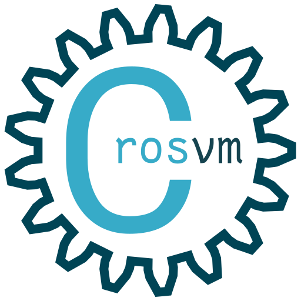

# √root of all repos
roar is a monorepo that contains all the projects that are part of the oknotok.computer ecosystem.

## [bldy](bldy)

bldy is a build system.  It features src lang. A powerful build orchestration language that is designed to be easy to use and understand. 

## [okLinux](oklinux)

okLinux is a Linux distribution that is strongly opinionated.

## [innit' guv](innitguv)

Governor of  Initalization, aka. innit 'guv is a init system that is designed to be simple and easy to understand.

## [JetStream](jetstream)

JetStream is the oknotok.computer rpc framework based on s2n-quic and 9p.

## [JetBridge](jetbridge)

JetBridge is a is a crosvm device that speaks 9p over quic, aka JetStream. 

3rd Party

## [libcrosvm](libcrosvm)

libcrosvm is a bastardized librarification of crosvm. It is a virtual machine monitor (VMM) based on Linux’s KVM hypervisor, with a focus on simplicity, security, and speed. libcrosvm is intended to run Linux guests, originally as a security boundary for running native applications on the ChromeOS platform. Compared to QEMU, libcrosvm doesn’t emulate architectures or real hardware, instead concentrating on paravirtualized devices, such as the virtio standard.

