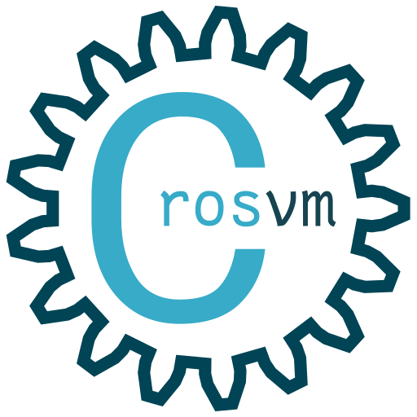

# crosvm - The ChromeOS Virtual Machine Monitor

crosvm is a virtual machine monitor (VMM) based on Linux’s KVM hypervisor, with a focus on
simplicity, security, and speed. crosvm is intended to run Linux guests, originally as a security
boundary for running native applications on the ChromeOS platform. Compared to QEMU, crosvm doesn’t
emulate architectures or real hardware, instead concentrating on paravirtualized devices, such as
the virtio standard.

crosvm is currently used to run Linux/Android guests on ChromeOS devices.

- [Documentation](https://crosvm.dev/book/)
- [Announcements](https://groups.google.com/a/chromium.org/g/crosvm-announce)
- [Developer Mailing List](https://groups.google.com/a/chromium.org/g/crosvm-dev)
- [#crosvm on matrix.org](https://matrix.to/#/#crosvm:matrix.org)
- [Source code](https://chromium.googlesource.com/crosvm/crosvm/)
  - [API doc](https://crosvm.dev/doc/crosvm/), useful for searching API.
  - For contribution, see [the contributor guide](https://crosvm.dev/book/contributing/). Mirror
    repository is available at [GitHub](https://github.com/google/crosvm) for your convenience, but
    we don't accept bug reports or pull requests there.
- [Public issue tracker](https://issuetracker.google.com/issues?q=status:open%20componentid:1161302)
  - For Googlers: See [go/crosvm#filing-bugs](https://goto.google.com/crosvm#filing-bugs).

