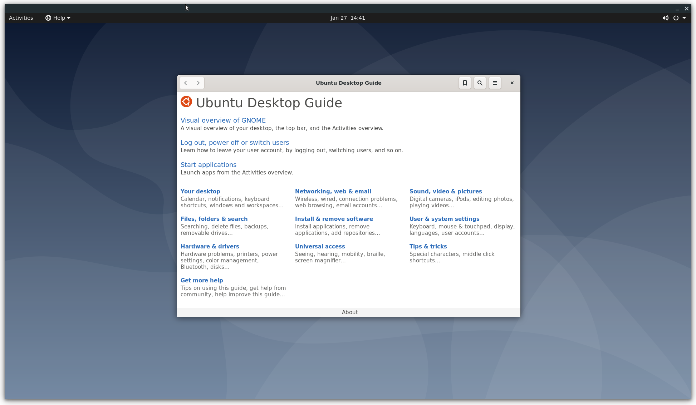

# Example Usage

This section will explain how to use a prebuilt Ubuntu image as the guest OS. If you want to prepare
a kernel and rootfs by yourself, please see [Custom Kernel / Rootfs](./custom_kernel_rootfs.md).

The example code for this guide is available in [tools/examples]

## Run a simple Guest OS (using virt-builder)

To run a VM with crosvm, we need two things: A kernel binary and a rootfs. You can
[build those yourself](./custom_kernel_rootfs.md) or use prebuilt cloud/vm images that some linux
distributions provide.

### Preparing the guest OS image

One of the more convenient ways to customize these VM images is to use [virt-builder] from the
`libguestfs-tools` package.

```bash
{{#include ../../../../tools/examples/example_simple:build}}
```

### Extract the Kernel (And initrd)

Crosvm directly runs the kernel instead of using the bootloader. So we need to extract the kernel
binary from the image. [virt-builder] has a tool for that:

```bash
{{#include ../../../../tools/examples/example_simple:kernel}}
```

The kernel binary is going to be saved in the same directory.

Note: Most distributions use an init ramdisk, which is extracted at the same time and needs to be
passed to crosvm as well.

### Add the user to the kvm group

To run crosvm without `sudo`, the user should be added to the `kvm` group in order to obtain the
access to the `/dev/kvm` file. If the user is already in the kvm group, skip this part. Otherwise,
execute the command below.

```bash
{{#include ../../../../tools/examples/example_simple:kvm}}
```

You can check if the user is in the kvm group or not with the following command:

```bash
groups | grep kvm
```

After executing the `adduser` command above, please logout and log back in to reflect the kvm group.

### Launch the VM

With all the files in place, crosvm can be run:

```bash
{{#include ../../../../tools/examples/example_simple:run}}
```

The full source for this example can be executed directly:

```bash
./tools/examples/example_simple
```

The login username will be the username on the host, and it will prompt to decide the password on
the first login in the VM.

## Add Networking Support

Networking support is easiest set up with a TAP device on the host, which can be done with:

```bash
./tools/examples/setup_network
```

The script will create a TAP device called `crosvm_tap` and sets up routing. For details, see the
instructions for [network devices](../devices/net.md).

With the `crosvm_tap` in place we can use it when running crosvm:

```bash
{{#include ../../../../tools/examples/example_network:run}}
```

To use the network device in the guest, we need to assign it a static IP address. In our example
guest this can be done via a netplan config:

First, create a guest directory and the netplan config:

```bash
mkdir guest/
touch guest/01-netcfg.yaml
```

Then edit guest/01-netcfg.yaml and add the following contents:

```yaml
{{#include ../../../../tools/examples/guest/01-netcfg.yaml:5:}}
```

The netplan config can be installed when building the VM image:

```bash
{{#include ../../../../tools/examples/example_network:build}}
```

This also allows us to use SSH to access the VM. The script above will install your
`~/.ssh/id_rsa.pub` into the VM, so you'll be able to SSH from the host to the guest with no
password:

```bash
ssh 192.168.10.2
```

WARNING: If you are on a gLinux machine, then you will need to disable Corp SSH Helper:

```bash
ssh -oProxyCommand=none 192.168.10.2
```

The full source for this example can be executed directly:

```bash
./tools/examples/example_network
```

## Add GUI support

First you'll want to add some desktop environment to the VM image:

```bash
{{#include ../../../../tools/examples/example_desktop:build}}
```

Then you can use the `--gpu` argument to specify how gpu output of the VM should be handled. In this
example we are using the virglrenderer backend and output into an X11 window on the host.

```bash
{{#include ../../../../tools/examples/example_desktop:run}}
```



The full source for this example can be executed directly (Note, you may want to run
[setup_networking](#add-networking-support) first):

```bash
./tools/examples/example_desktop
```

[tools/examples]: https://source.chromium.org/chromiumos/chromiumos/codesearch/+/main:src/platform/crosvm/tools/examples
[virt-builder]: https://libguestfs.org/virt-builder.1.html
